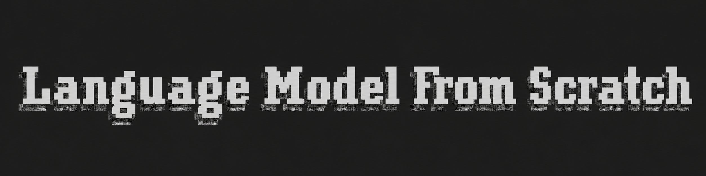
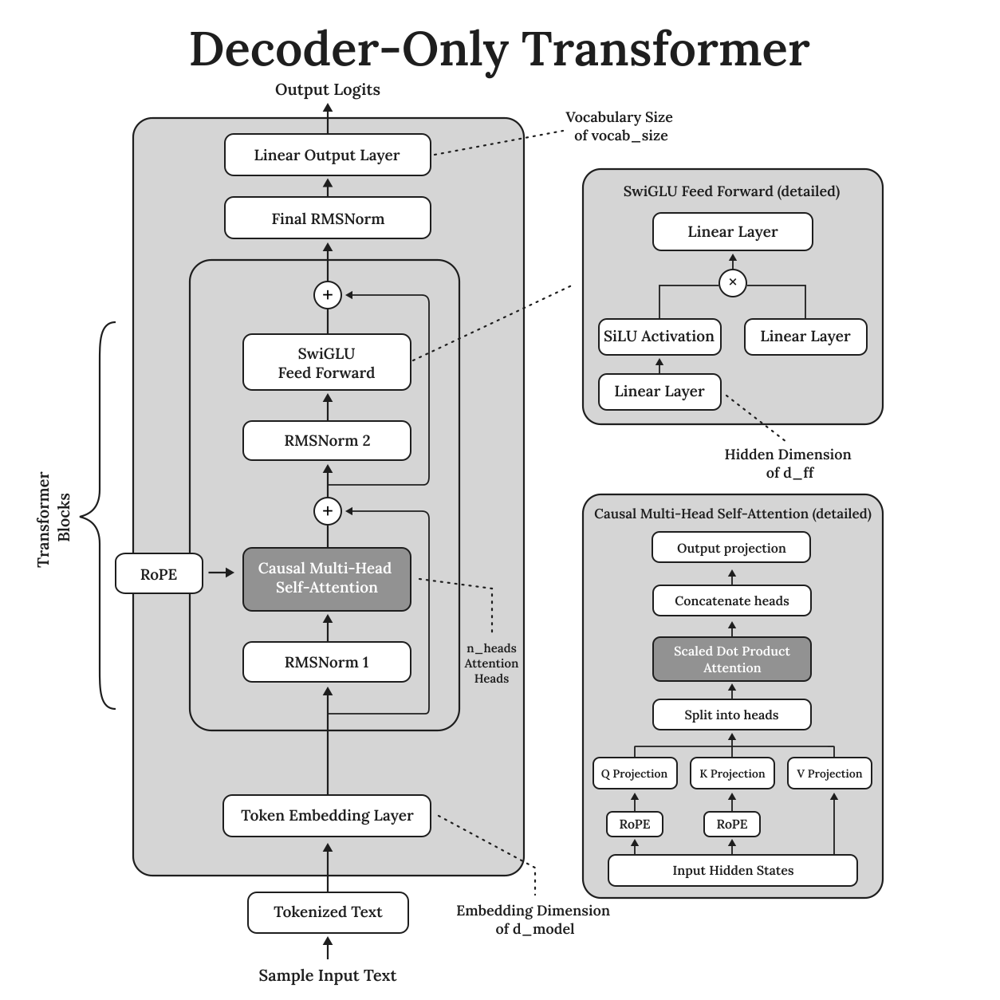

# Language Model From Scratch

  

Este repositório contêm uma implementação do zero, simples e organizada de um modelo de linguagem "tipo GPT".

O modelo foi desenvolvido em [`pytoch`](https://pytorch.org/) e pré-treinado no dataset [`corpuscarolina`](https://sites.usp.br/corpuscarolina/).

## Overview

## Architecture

  

## Parameters

| Hyperparameter | Value |
|---|---:|
| Total Parameters | **51.45M** |
| Vocabulary Size (`vocab_size`) | 32.000 |
| Context Length (`context_length`) | 512 |
| Model Dimension (`d_model`) | 512 |
| Feed-Forward Dimension (`d_ff`) | 1.344 |
| Attention Heads (`num_heads`) | 8 |
| Transformer Layers (`num_layers`) | 6 |
| RoPE Theta (`theta`) | 10.000 |

## Installation

## Quickstart

## Results

## Examples

## References

## License